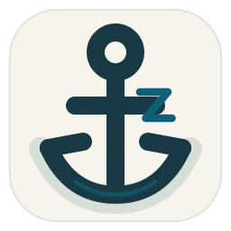
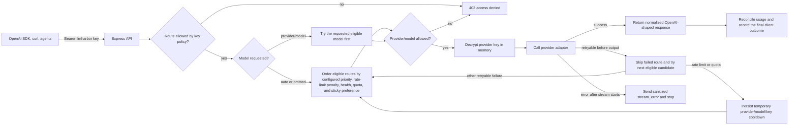

<div align="center">
  

  # LLMHarbor

  A self-hosted OpenAI-compatible LLM gateway and control plane for provider APIs, OAuth-backed accounts, local models, and custom endpoints.

  <p>
    <a href="https://github.com/PLASMA-FR/LLMHarbor/actions"></a>
    <a href="./LICENSE"></a>
    
    
  </p>

  <p>
    <a href="#quick-start">Quick start</a> ·
    <a href="#using-the-api">API</a> ·
    <a href="#supported-providers">Providers</a> ·
    <a href="#bulk-import-provider-keys">Bulk import</a> ·
    <a href="#client-key-access-policies">Access policy</a> ·
    <a href="#terms-of-use">Terms of Use</a> ·
    <a href="https://plasma-fr.github.io/LLMHarbor/">Website</a> ·
    <a href="#contributing">Contributing</a>
  </p>
</div>

## What is LLMHarbor?

LLMHarbor routes chat completions across upstream LLM providers while exposing the OpenAI API shape your clients already know. It manages multiple client API keys with route/provider/model access policies, encrypted provider credentials, OAuth-backed accounts, fallback order, health checks, per-key traffic tracking, custom provider endpoints, model probes, streaming responses, tool calls, and request analytics.

Use it when you want one stable local endpoint for experiments, coding agents, small tools, and personal workflows without wiring every provider into every app.

```txt
Your app / OpenAI SDK
        |
        |  Bearer llmharbor-...
        v
LLMHarbor local proxy
        |
        |  chooses a healthy model under quota
        v
Provider APIs · OAuth-backed accounts · local models · custom endpoints
```

## Why it exists

Free tiers are useful, but they are scattered. Each provider has its own key, model list, rate limit, streaming quirks, error format, and tool-call behavior. One provider fails with a 429. Another times out. A third changes the model ID you were using.

LLMHarbor puts a harbor in front of that traffic.

- One local OpenAI-compatible base URL.
- Multiple client API keys for apps, agents, laptops, and experiments.
- Per-key route, provider, and model gates before any upstream quota is spent.
- API-key providers and OAuth-backed accounts behind it.
- A fallback chain you can inspect and reorder.
- A dashboard that shows what happened after each request.

It is not meant to sell free tiers as production infrastructure. It is meant to make personal routing sane.

## Highlights

| Area | What LLMHarbor does |
|---|---|
| OpenAI compatibility | `POST /v1/chat/completions` and `GET /v1/models` work with OpenAI-style SDKs and clients. Model IDs are exposed as `provider/model` so duplicate upstream IDs stay unambiguous. |
| Auto routing | Use `model: "auto"` and let the router choose the highest-priority healthy model under quota. |
| Fallbacks | Retryable failures skip the failed credential for that request and continue through eligible routes. Rate-limit and quota failures also place that provider/model/key combination on a temporary cooldown. |
| Streaming | Server-Sent Events are supported for `stream: true`. |
| Tool calls | OpenAI-style `tools`, `tool_choice`, assistant `tool_calls`, and tool follow-up messages round trip through the proxy. |
| Client keys | Mint multiple OpenAI-compatible client keys, label them by app or device, and set per-key route/provider/model access policies. |
| OAuth-backed accounts | Connect OpenAI/ChatGPT and Antigravity through PKCE loopback OAuth, or Freebuff through its browser device flow, with encrypted token storage and live model discovery. |
| Key storage | Provider keys and OAuth tokens are encrypted with AES-256-GCM and a fresh 96-bit nonce per write before they are stored in SQLite. Local client keys are stored as one-way digests. |
| Rate tracking | RPM, RPD, TPM, and TPD counters are tracked for upstream providers, models, and routing health. |
| Sticky sessions | Multi-turn conversations can stay on the same model for a short window to avoid mid-thread model jumps. |
| Custom providers | Add HTTP(S) OpenAI-compatible endpoints that pass the destination safety checks. Local vLLM, Ollama-compatible gateways, OpenCode Zen, and private gateways fit here. |
| Model probes | Test whether a model works before putting traffic on it. |
| Analytics | Track request count, success rate, latency, token use, provider split, model split, and recent failures. |

## Supported providers

LLMHarbor ships with adapters and catalog entries for the common free-tier and OpenAI-compatible routes. Some providers require account setup or have stricter terms than others.

| Provider | Typical models or routes | Notes |
|---|---|---|
| OpenAI API keys | OpenAI chat models | OpenAI-compatible API adapter. |
| Google API keys | Gemini Flash and Pro family | Native adapter with OpenAI shape translation. |
| OpenAI / ChatGPT OAuth | Account-discovered GPT and Codex routes | Browser OAuth account flow with loopback callback and live inventory. |
| Antigravity OAuth | Google Code Assist / Gemini routes | Browser OAuth account flow with Code Assist inventory and reconnect handling. |
| Freebuff browser accounts | Account-discovered Freebuff routes | Browser-account token flow with session management. |
| Groq | Llama, GPT-OSS, Qwen | Fast OpenAI-compatible route. |
| Cerebras | Qwen and Llama routes | Fast inference, quota-dependent. |
| SambaNova | DeepSeek, Llama, Gemma | OpenAI-compatible route. |
| NVIDIA NIM | NVIDIA-hosted open models | Credit- and quota-dependent OpenAI-compatible route. |
| Mistral | Mistral Large, Codestral, Devstral | OpenAI-compatible route. |
| OpenRouter | Free and paid OpenRouter models | Works well as an extra model pool. |
| GitHub Models | GPT-4.1, GPT-4o family | Useful for prototyping. |
| Cloudflare Workers AI | Kimi, GLM, GPT-OSS, Granite | Account and route configuration required. |
| Cohere | Command family | Supported, but review terms before personal use. |
| HuggingFace Router | Provider-routed open models | OpenAI-compatible route. |
| Zhipu / Z.ai | GLM family | Terms differ by entity and endpoint. |
| Ollama Cloud | Cloud model access | Good for local-first workflows. |
| Kilo Gateway | Provider-routed models | OpenAI-compatible aggregator; availability is provider-dependent. |
| Pollinations | Provider-routed models | OpenAI-compatible endpoint; availability is provider-dependent. |
| LLM7 | Provider-routed models | OpenAI-compatible aggregator; availability is provider-dependent. |
| Custom OpenAI-compatible | vLLM, LiteLLM, OpenCode Zen, private gateways | Add from Providers, then register models on Models. |

## Quick start

### Prerequisites

- Node.js `^22.12.0` or `^24.0.0` (supported LTS lines)
- npm
- A provider API key, or a local OpenAI-compatible endpoint to add later

### One-line install

macOS / Linux:

```bash
curl -fsSL https://raw.githubusercontent.com/PLASMA-FR/LLMHarbor/main/install.sh | bash
llmharbor start
llmharbor open
```

macOS-specific installer with Homebrew/Xcode hints:

```bash
curl -fsSL https://raw.githubusercontent.com/PLASMA-FR/LLMHarbor/main/install-macos.sh | bash
```

Windows PowerShell:

```powershell
irm https://raw.githubusercontent.com/PLASMA-FR/LLMHarbor/main/install.ps1 | iex
llmharbor start
llmharbor open
```

The installers clone the repo, create a local `.env` with a fresh encryption key, install dependencies, build the production app, and place a `llmharbor` command on your PATH. Defaults:

| OS | App directory | Command directory |
|---|---|---|
| Linux/macOS | `~/.llmharbor/app` | `~/.local/bin` or `/usr/local/bin` on macOS when writable |
| Windows | `%USERPROFILE%\.llmharbor\app` | `%LOCALAPPDATA%\LLMHarbor\bin` |

Override with `LLMHARBOR_HOME`, `LLMHARBOR_BIN_DIR`, or `LLMHARBOR_REPO` when needed.

### Manual install

```bash
git clone https://github.com/PLASMA-FR/LLMHarbor.git
cd LLMHarbor
npm ci
```

Create an environment file:

```bash
node -e 'const fs=require("fs"),key=require("crypto").randomBytes(32).toString("hex"),source=fs.readFileSync(".env.example","utf8");fs.writeFileSync(".env",source.replace(/^ENCRYPTION_KEY=.*$/m,`ENCRYPTION_KEY=${key}`),{mode:0o600});fs.chmodSync(".env",0o600)'
```

Start the server and dashboard together:

```bash
npm run dev
```

Or use the bundled command line:

```bash
./bin/llmharbor install
./bin/llmharbor start
./bin/llmharbor open
```

Open the dev dashboard:

```txt
http://localhost:5173
```

Production runs on:

```txt
http://localhost:3001
```

Then:

1. Go to **Providers** and add provider keys or a custom endpoint.
   - For one key, paste it into **Add a provider key**.
   - For many keys, use **Bulk import provider keys** with a `.txt` file: choose the provider target, then upload one key per line. The dashboard submits the provider's stable platform identifier.
2. Go to **Models** and probe the models you want to use.
3. Optional: go to **OAuth accounts** and connect OpenAI/ChatGPT, Antigravity, or Freebuff.
4. Go to **Routing** and order the route list.
5. Create a client API key from **Client access** and save the secret shown once.
6. Configure that key’s quotas and route/provider/model policy in **Client access**.
7. Point your OpenAI-compatible client at `http://localhost:3001/v1`.

### Production build

```bash
npm run build
node server/dist/index.js
```

The production server serves the API and built dashboard on port `3001` by default. If you want the bundled CLI as a hosted custom start command, run it in foreground mode instead of using the background daemon wrapper:

```bash
llmharbor start --foreground --host 0.0.0.0 --port "${PORT:-3001}"
```

For local machines, omit `--foreground` to keep using the managed PID/log flow:

```bash
llmharbor start --host 127.0.0.1 --port 3001
llmharbor status
llmharbor logs
```

### Tailscale dashboard + public API split

Use split mode when you want the dashboard/control plane reachable only on your Tailscale IP while the OpenAI-compatible API is reachable on the machine's public IP. The public listener serves `/v1/*`, legacy `/e/:slug/v1/*` compatibility routes, and `/api/ping`; dashboard pages and mutating control-plane routes are not mounted there.

```bash
# Detect your Tailscale IPv4 and write the split listener settings to .env.
# Defaults: dashboard http://<tailscale-ip>:3002, public API http://<public-ip>:3001/v1
llmharbor tailscale
llmharbor restart
llmharbor url
```

You can also pass the listener settings directly to `start`/`restart` without editing `.env`. Use `--foreground` for hosted custom start commands; omit it for the local background daemon. Add `--save` if you want the flags written to `.env` for future starts.

```bash
llmharbor start --foreground \
  --dashboard-host 100.x.y.z \
  --dashboard-port 3002 \
  --public-api-host 0.0.0.0 \
  --public-api-port 3001 \
  --trusted-network
```

Equivalent `.env` shape:

```dotenv
LLMHARBOR_DASHBOARD_HOST=100.x.y.z
LLMHARBOR_DASHBOARD_PORT=3002
LLMHARBOR_DASHBOARD_TRUSTED_NETWORK=1
LLMHARBOR_PUBLIC_API_HOST=0.0.0.0
LLMHARBOR_PUBLIC_API_PORT=3001
```

`--trusted-network` allows non-loopback clients that can reach the dashboard listener to use the control plane; it does not add dashboard login or another authentication layer. Bind that listener only to a private VPN interface. Keep a firewall in front of the public port and use scoped `llmharbor-*` client keys for apps that call the public `/v1` API.

## Using the API

LLMHarbor accepts OpenAI-style chat requests. Change the base URL and API key, then keep using the client you already use.

### Python

```python
import os
from openai import OpenAI

client = OpenAI(
    base_url="http://localhost:3001/v1",
    api_key=os.environ["LLMHARBOR_API_KEY"],
)

response = client.chat.completions.create(
    model="auto",  # or e.g. "groq/llama-3.3-70b-versatile" from GET /v1/models
    messages=[
        {"role": "user", "content": "Explain SQLite WAL mode in two sentences."}
    ],
)

print(response.choices[0].message.content)
```

### curl

```bash
curl http://localhost:3001/v1/chat/completions \
  -H "Authorization: Bearer YOUR_LLMHARBOR_KEY" \
  -H "Content-Type: application/json" \
  -d '{
    "model": "auto",
    "messages": [{"role": "user", "content": "hi"}]
  }'
```

`GET /v1/models` returns only models that are enabled, allowed by the client key, and backed by an eligible configured credential. It includes `auto` when at least one such model exists. Transient cooldown or quota pressure does not make catalog rows disappear between SDK refreshes; inspect Routing for current availability. Send an exact provider-prefixed ID from this response when you want the router to try that provider/model first.

### Client key access policies

Local `llmharbor-*` keys can be scoped without touching upstream provider credentials. Create one key per app, then decide which local routes, provider endpoints, and model rows that key may use.

```bash
curl http://127.0.0.1:3001/api/client-keys \
  -H "Content-Type: application/json" \
  -d '{
    "label": "editor agent"
  }'
```

Access policies are stored per local key. They can block an OpenAI-compatible route such as `/v1/models`, deny a whole provider endpoint, or hide and reject a specific model before any upstream provider call is made.

```bash
# Inspect routes, provider endpoints, and model rows available to one key
curl http://127.0.0.1:3001/api/client-keys/1/access-policy

# Block model catalog listing and one provider for that key
curl -X PATCH http://127.0.0.1:3001/api/client-keys/1/access-policy \
  -H "Content-Type: application/json" \
  -d '{
    "routes": [{"route":"v1.models","enabled":false}],
    "platforms": [{"platform":"google","enabled":false}]
  }'
```

Custom local endpoint creation is intentionally retired: `POST /api/settings/local-endpoints` returns `410`. Keep using `/v1` and segment apps with key-specific policy instead.

### OAuth-backed accounts

The OAuth page connects OpenAI/ChatGPT and Antigravity accounts through PKCE loopback callbacks and connects Freebuff through its browser device-code flow. Tokens are stored encrypted. Discovery refreshes provider-reported model inventory and usage windows so `/v1/models` only exposes models that are actually routeable. When you open the dashboard from another machine over Tailscale/VPN, the provider's fixed `localhost` redirect may end on that remote browser instead of the LLMHarbor host. The dashboard then offers a short-lived field for the complete returned callback URL; LLMHarbor validates the exact loopback route and consumes the original state and PKCE verifier once before exchanging the code. Antigravity uses Google Code Assist's native desktop client by default, so the Connect button is available on a fresh local install; set `LLMHARBOR_ANTIGRAVITY_OAUTH_CLIENT_SECRET` only if Google rotates that public client credential and you need to override it.

Qwen OAuth was removed because the device-code path no longer provides a usable free approval flow and can require a paid Qwen account before approval. Use Qwen-family models through supported free-tier providers such as OpenRouter, Groq, or Cerebras when available.

```bash
# Start browser-account login flows from the local dashboard/API
POST /api/oauth/connect/openai/start
POST /api/oauth/connect/antigravity/start

# Refresh discovered account models and limits
GET /api/oauth/accounts/:id/models
```

### Bulk import provider keys

If you have a batch of provider credentials, create a plain text file with one key per line:

```txt
key-one
key-two
# comments and blank lines are ignored
key-three
```

Open **Providers → Import keys**, choose a target from the current provider list, upload the file, and import. The dashboard submits the provider's stable `platform` value returned by `GET /api/provider-keys/providers`; legacy numeric list positions remain accepted only for older clients. Cloudflare lines use the same stored shape as the single-key form: `account_id:api_token`.

The same flow is available through the local control-plane API:

```bash
curl http://127.0.0.1:3001/api/provider-keys/import \
  -H "Content-Type: application/json" \
  -d '{"platform":"google","contents":"key-one\nkey-two","labelPrefix":"Google batch"}'
```

### Streaming

```python
stream = client.chat.completions.create(
    model="auto",
    messages=[{"role": "user", "content": "Stream a short haiku about SQLite."}],
    stream=True,
)

for chunk in stream:
    print(chunk.choices[0].delta.content or "", end="", flush=True)
```

Streams use OpenAI-style `data: {...}` SSE frames followed by `data: [DONE]`. `stream_options: {"include_usage": true}` is accepted. A provider failure can fall back before the first substantive frame; after output starts, LLMHarbor emits a sanitized `stream_error` frame and terminates instead of replaying the request and duplicating partial output.

### Tool calling

```python
tools = [{
    "type": "function",
    "function": {
        "name": "get_weather",
        "description": "Get current weather for a city.",
        "parameters": {
            "type": "object",
            "properties": {"city": {"type": "string"}},
            "required": ["city"],
        },
    },
}]

first = client.chat.completions.create(
    model="auto",
    messages=[{"role": "user", "content": "What's the weather in Karachi?"}],
    tools=tools,
    tool_choice="required",
)

call = first.choices[0].message.tool_calls[0]

final = client.chat.completions.create(
    model="auto",
    messages=[
        {"role": "user", "content": "What's the weather in Karachi?"},
        first.choices[0].message,
        {"role": "tool", "tool_call_id": call.id, "content": '{"temp_c": 32, "cond": "sunny"}'},
    ],
    tools=tools,
)

print(final.choices[0].message.content)
```

Requests containing tool definitions, assistant tool calls, or tool-result messages only use routes that can preserve those semantics. In particular, the private ChatGPT OAuth Responses surface is excluded from tool-call requests instead of silently dropping tool data.

Every successful response includes routing headers when available:

| Header | Meaning |
|---|---|
| `X-Routed-Via` | Provider and model that served the request. |
| `X-Fallback-Attempts` | Number of failed route attempts before the successful route. |
| `X-Request-Id` | Correlation ID for request diagnostics, including failures. |

## Dashboard map

| Page | Use it for |
|---|---|
| Overview | Check service health, route readiness, quota pressure, recent traffic, and failures. |
| Playground | Test streaming, tools and refusals; preview Markdown or inspect plain text; copy code, responses or export the thread. Conversations survive navigation until reload. |
| Providers | Connect upstream credentials and custom endpoints, import keys, inspect health, and replace credentials in place. Local endpoints can use anonymous upstream access. |
| Client access | Create one-time client keys, rotate secrets, edit quotas and configure paged provider/model access policies. |
| OAuth accounts | Connect browser accounts, refresh discovered models, inspect account limits, and handle reconnects. |
| Models | Search, register, probe and enable a route on the same page; edit catalog state, context windows and quotas. |
| Routing | Preview an ordered draft, then save it with protection against concurrent changes and accidental navigation. |
| Analytics | Inspect aggregate usage or paginated request history, including per-client attribution and fallback traces. |
| API & SDKs | Generate cURL, JavaScript and Python examples, diagnose errors and download OpenAPI. |
| Settings | Manage discovery and backups in separate workflows; monitor or cancel discovery and inspect staged restores. |

Model-setting and client-limit PATCH requests preserve omitted fields; send `null` to clear a quota. Newly discovered models remain unavailable to routing until their first successful verification. The discovery scheduler resumes its saved next-run deadline after a restart.

Press **Ctrl/Cmd+K** to find a page. Mobile navigation uses a keyboard-accessible drawer. See the [UX and API guide](docs/ux-and-api.md) for canonical resource paths, compatible aliases and interaction conventions.

### API discovery and diagnostics

Open `/v1` for inference discovery, `/v1/openapi.json` for its schema, or `/api/openapi.json` for the full control-plane contract. All JSON errors include a code and request ID; validation errors also identify individual fields. The API accepts `developer` messages and `max_completion_tokens` as an alternative to `max_tokens`. Unsupported multiple completions and JSON-schema output fail explicitly; other unrecognized fields are reported in `X-LLMHarbor-Ignored-Parameters`.

Canonical control resources are `/api/providers`, `/api/provider-keys`, `/api/client-keys`, `/api/routing`, `/api/discovery` and `/api/backups`. Older paths remain supported. Add `?limit=25` to key lists for cursor pagination, or use `/api/requests` and `/api/requests/{id}` to inspect routed traffic. Control APIs retain the local/private dashboard boundary; client Bearer keys authenticate the `/v1` inference API.

## How routing works


```mermaid
flowchart LR
  A[OpenAI SDK, curl, agents] -->|Bearer llmharbor key| B[Express API]
  B --> P{Route allowed by key policy?}
  P -->|no| Z[403 access denied]
  P -->|yes| C{Model requested?}
  C -->|auto or omitted| D[Order eligible routes by configured priority, rate-limit penalty, health, quota, and sticky preference]
  C -->|provider/model| E[Try the requested eligible model first]
  D --> Q{Provider/model allowed?}
  E --> Q
  Q -->|no| Z
  Q -->|yes| F[Decrypt provider key in memory]
  F --> G[Call provider adapter]
  G -->|success| H[Return normalized OpenAI-shaped response]
  G -->|retryable before output| I[Skip failed route and try next eligible candidate]
  G -->|error after stream starts| K[Send sanitized stream_error and stop]
  I -->|rate limit or quota| L[Persist temporary provider/model/key cooldown]
  I -->|other retryable failure| D
  L --> D
  H --> J[Reconcile usage and record the final client outcome]
```

Routing exposes configured and effective priority, credential counts, cooldown state, and a concrete skip reason. Rate-limit penalties decay over time; other retryable failures only exclude the failed credential from the current request.

Main pieces:

| Component | Path | Responsibility |
|---|---|---|
| API app | `server/src/app.ts` | Express routes, CORS, OpenAI-compatible surface. |
| Router | `server/src/services/router.ts` | Model choice, fallback attempts, sticky sessions. |
| Rate limiter | `server/src/services/ratelimit.ts` | Provider-side RPM, RPD, TPM, TPD accounting and cooldowns. |
| Providers | `server/src/providers/*.ts` | Provider-specific request and streaming adapters. |
| Keys routes | `server/src/routes/keys.ts` | Provider credential management and bulk import. |
| Client key routes | `server/src/routes/clientKeys.ts` | Client keys, secret rotation, quotas and access policies. |
| Settings routes | `server/src/routes/settings.ts` | Connection settings and legacy endpoint compatibility. |
| OAuth routes | `server/src/routes/oauth.ts` | Browser-account OAuth flows, encrypted account storage, and discovered inventory. |
| Access policy service | `server/src/services/accessPolicy.ts` | Per-client-key policy snapshots, persistence, and enforcement helpers. |
| Endpoint routes | `server/src/routes/endpoints.ts` | Custom providers and model registry. |
| Database | `server/src/db/index.ts` | SQLite schema, seed catalog, encrypted key storage. |
| Dashboard | `client/src` | React control plane. |
| Shared types | `shared/types.ts` | Request, model, provider, and analytics types. |

## Security model

LLMHarbor is local-first and single-user by design.

- Provider keys and OAuth tokens are encrypted at rest with AES-256-GCM and a fresh 96-bit nonce for every encryption.
- Installers generate a 64-character hexadecimal `ENCRYPTION_KEY` in `.env`. If no explicit key is configured for a file-backed database, LLMHarbor creates a mode-restricted `<database>.key` sidecar instead. Startup fails closed when a configured key conflicts with the key that protects existing credentials.
- Local `llmharbor-*` client keys are stored as one-way SHA-256 digests and are shown only when created or regenerated.
- Clients call LLMHarbor with a `llmharbor-...` token.
- Each local client token can have independent route, provider, and model policy.
- Provider keys and OAuth tokens are never returned in plaintext by listing or backup endpoints after storage.
- The server binds to `127.0.0.1` by default. Set `HOST=0.0.0.0` only behind your own firewall, VPN, or authenticated reverse proxy.
- The dashboard/control-plane API stays loopback-only by default even when the authenticated `/v1` proxy is remotely bound. Set `LLMHARBOR_ALLOW_REMOTE_CONTROL_PLANE=1` only behind your own network controls.
- Browser requests are limited to the built-in Vite development origins plus exact, comma-separated origins in `DASHBOARD_ORIGINS`. CORS is not authentication and does not protect the control plane from non-browser clients.
- A same-host reverse proxy reaches LLMHarbor over loopback, so configure it to forward `/v1` only; never forward `/api` or dashboard routes to the public internet.
- Custom endpoint URLs accept HTTP(S) loopback/private-network targets for local models but reject embedded credentials, query strings, fragments, cloud-metadata/link-local destinations, redirects, and unsafe DNS resolutions.

### Backups and restore

Settings streams a consistent SQLite snapshot directly to disk, avoiding a large base64 document in browser memory. It contains encrypted provider/OAuth credentials, client-key digests, policies, routing state, usage, and analytics. Existing client-key secrets still authenticate after a restore, but their plaintext cannot be recovered from the backup.

The export intentionally excludes `.env` and the generated `<database>.key` sidecar. Preserve the matching `ENCRYPTION_KEY` or sidecar separately; ciphertext cannot be decrypted with a different key. The dashboard streams `.db` imports with an explicit restore-confirmation header and still accepts legacy `llmharbor.full-instance-backup.v1` JSON envelopes up to their 128 MiB binary compatibility limit. Use the streamed format for larger instances. It validates the optional checksum, SQLite integrity, startup schema compatibility, and credential-encryption key, then returns `202 Accepted`, stages the restore, and keeps the active database running. Restart LLMHarbor to activate it. Activation validates the staged files again, uses atomic file replacement, and restores the original files if activation fails; a timestamped pre-import database copy is also retained.

## What is not supported yet

LLMHarbor focuses on OpenAI-compatible chat completions. These endpoint families are out of scope:

- Images: `/v1/images/generations`
- Audio speech: `/v1/audio/speech`
- Embeddings: `/v1/embeddings`
- Moderation: `/v1/moderations`
- Legacy completions: `/v1/completions`
- Non-text image/audio message content (text content blocks are normalized; vision and audio inputs are not forwarded)
- `n > 1` multi-completion requests
- Multi-tenant auth, billing, orgs, or team management

## Development

```bash
npm ci
npm run dev       # server on :3001, dashboard on :5173
npm run typecheck # strict TypeScript checks for both workspaces
npm test          # server Vitest suite, plus client tests if present
npm run build     # TypeScript + Vite production build
npm run check     # dashboard lint, tests, and both production builds
npx playwright install chromium
npm run test:e2e  # production-dashboard workflows with a local simulated provider
```

Useful workspace commands:

```bash
npm run build -w server
npm run build -w client
npm run test -w server
```

CLI commands:

```bash
./bin/llmharbor doctor   # check git, node, npm, curl, .env, and build output
./bin/llmharbor install  # install dependencies, create .env, and build
./bin/llmharbor start    # run production server in the background
./bin/llmharbor status   # show process and health-check status
./bin/llmharbor logs     # follow server logs
./bin/llmharbor stop     # stop the background server
./bin/llmharbor update   # git pull, rebuild, and restart if running
```

Lifecycle commands serialize start/stop/update operations and validate saved process identity before signaling a PID. `start` and `restart` flags are one-shot unless you pass `--save`; a no-argument restart reuses newer runtime listener settings, while an edited `.env` or explicit environment values take precedence. Set `LLMHARBOR_STARTUP_TIMEOUT` to an integer from 1 to 300 seconds when startup needs longer than the default health-check window.

`llmharbor update` accepts only a clean git checkout with a configured upstream and a fast-forward update. It fetches and validates the update before stopping a CLI-managed process, and refuses active systemd or untracked healthy listeners so it cannot stop the wrong service. Once the intentional stop has happened, an install or build failure leaves the service stopped and reports the failing command; fix the checkout and start it again rather than assuming an automatic rollback occurred.

Before opening a PR:

```bash
npm run check
npm audit
```

## Project structure

```txt
LLMHarbor/
  client/               React + Vite dashboard
    src/components/     Shared UI primitives and app shell pieces
    src/pages/          Overview, providers, client access, models, routing, OAuth, analytics, API guide, settings
  server/               Express API and provider routing
    src/db/             SQLite schema and model catalog
    src/providers/      Provider adapters
    src/routes/         API routes
    src/services/       Router, health checks, rate limiter
  shared/               Shared TypeScript types
  bin/                  LLMHarbor command line
  website/              Static GitHub Pages site
  docs/                 Project logos and Open Graph assets
  repo-assets/          Historical dashboard screenshots
  install.sh            Curl-friendly installer script
```

## Environment

Common `.env` values:

```bash
ENCRYPTION_KEY=replace-with-64-hex-characters
HOST=127.0.0.1
PORT=3001
# DASHBOARD_ORIGINS=https://dashboard.example.internal
# LLMHARBOR_MAX_BACKUP_BYTES=4294967296
```

Provider keys are normally added in the dashboard. SQLite data and the generated encryption-key sidecar live under `server/data/`. Keep `.env`, `server/data/`, exported backups, and encryption-key copies out of commits.

## Limitations and honest notes

- Free-tier quotas move. Providers can change limits or remove models without warning.
- The best model in your chain may run out early in the day. After that, routing falls to the next enabled model.
- Latency varies by provider. Groq and Cerebras are often fast. Others may not be.
- Some provider terms limit production, resale, personal use, or traffic relay patterns. Read the terms for each account you connect.
- There is no SLA. If the request matters, use a paid provider directly or put LLMHarbor behind your own reliability layer.

## Contributing

Good contributions are practical and testable.

- Add a provider adapter.
- Add an endpoint family such as embeddings or images.
- Improve fallback scoring.
- Improve analytics and charts.
- Add deployment recipes.
- Tighten copy, accessibility, keyboard behavior, or empty states.
- Add tests for provider quirks and rate-limit edge cases.

A provider PR usually touches:

```txt
server/src/providers/<provider>.ts
server/src/providers/index.ts
server/src/db/index.ts
server/src/__tests__/providers/<provider>.test.ts
```

Please keep PRs focused and include tests for routing behavior when possible.

See [CONTRIBUTING.md](CONTRIBUTING.md) for focused validation commands and [engineering notes](docs/engineering-notes.md) for the architecture and audit scope.

## Terms of Use

LLMHarbor is a self-hosted routing tool. It does not bypass provider terms, quota systems, paid access requirements, or account policies. You are responsible for how every upstream API key and browser account is used.

### Antigravity account warning

**Paid Antigravity accounts may be banned for using this tool.** Antigravity uses Google OAuth and Google Code Assist account surfaces that can flag automated routing, shared OAuth-client behavior, repeated refreshes, or non-standard access patterns.

Use a free Google account for Antigravity OAuth instead of your primary, paid, work, school, or Google Workspace account. Do not connect an account you cannot afford to lose.

- Read the terms for every provider you connect.

This is not legal advice. LLMHarbor contributors are not responsible for provider bans, quota changes, account suspensions, or service interruptions.

## License

MIT. See [LICENSE](./LICENSE).
